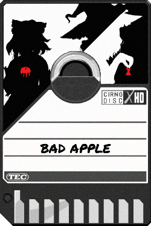

## Bad Apple played on Exapunks TEC Redshift
Have you ever had the need to play a high-quality music video in crisp *40p* and 4-channel polyphonic sound, all on your very own TEC Redshift using EXA technology? Well you're in luck because now you can watch the full Bad Apple music video all packaged into a single png cartridge. (TEC Redshift player and batteries not included)

In this repository you'll find the cartridge:

As well as a few other files containing the EXA code.

As of now, the python code used to generate the code has not been published due to it relying on a custom un-published library.

## FAQ
**It doesn't want to start, what do I do?**

Due to the sheer size of the code and data, the exapunks syntax highlighter causes a lot of lag. The only reliable way to start the video I found is to hold or repeatedly press `Tab` until the game registers an input and steps a frame. Once in the EXA runtime, the lag from the syntax highlighter will cease to be. Then press `F5` to run at the fastest speed (though lag might still occur).

**Why?**

Why not?

**How?**

A how it's made video is canceled because I suck at making videos, instead you get the python source code which I did my best to comment decently. (Tho I'm not sure it works lol, it's code I've written as a one-off afterall but feel free to try.)

The general gist is that I wrote a bunch of python code to automatically generate a custom heavily compressed exa-video format as well as converting midi tracks into a sort of exa-midi format.

For details, read the python source code.

*What you need to do to make your own video:*
 - Step 1: Read the code and fill in various filenames and fix my bugs probably
 - Step 2: Process your video using video_to_examov.py to create a .examov video containing run-length encoded black and white video
 - Step 3: Compress the video data using shedule_and_compress.py into a format the exa code accepts
 - Step 4: Get 4 monophonic midi tracks you wanna turn into .examus using midi_to_examus.py
 - Step 5: Combine the data together with the code into a runable .solution file using inject_code.py
 - Step 6: Use exapunks to export into an image and play it on the TEC Redshift Player
 - (Optional) Use image_copying.py to change the visual look of your video.

*Code Dependencies:*

`video_to_examov.py`: ffmpeg, numpy

`inject_code.py`: [exapunks](https://github.com/IQuick143/exapunks-py)

`image_copying.py`: Pillow, numpy

`compress.py`: mido